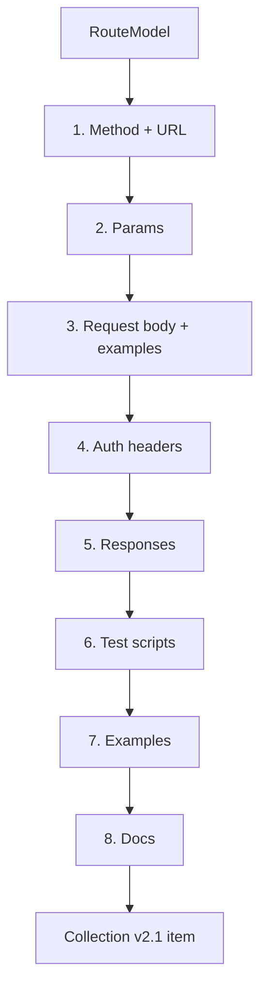

# The engine

The engine is the only hard thing in Postman MCP. Everything else is a selector that
feeds it.

> **Input:** one normalized `RouteModel`.
> **Output:** one complete Postman Collection v2.1 item — `request`, `response[]`,
> `event[]` (scripts), and `description`.

Module: `engine/builder.py` (with `engine/examples.py` and `engine/tests.py`).

## The pipeline

| Step | What it produces |
|---|---|
| **1. Method + URL** | From the route model; `{{base_url}}` prefixes the path; `--into` / `defaultInto` decides the folder. |
| **2. Params** | Path params from the route pattern; query/header params from the signature or decorators. |
| **3. Request body** | From the body type (Pydantic / Zod / serializer / DTO / TS interface). Each field gets a realistic example from its type and name. |
| **4. Auth headers** | If the route is behind auth middleware, set Bearer `{{token}}` and add the header. |
| **5. Responses** | One saved response per declared status: every 2xx with real field names, plus the standard error set (400/401/403/404/422/500) in the framework's error format. |
| **6. Test scripts** | Three tiers — see below. |
| **7. Examples** | Realistic dummy values for body + params, reused across the request and its saved responses. |
| **8. Docs** | Request description from the code's docstring / comments. |

## Realistic examples

The engine infers example values from each field's **type and name** (`engine/examples.py`):

| Field name pattern | Example |
|---|---|
| `email` | a fake email address |
| `amount`, `price`, `total` | a number |
| `created_at`, `*_at`, `*_date` | an ISO-8601 date |
| `id`, `*_id` | an id-shaped value |
| `name`, `title` | a plausible string |

This is what makes a synced request usable immediately — no manual fill.

## The three test tiers

`engine/tests.py` emits three tiers of test scripts, in increasing risk:

1. **Status** — deterministic. Asserts the response status code.
2. **Schema** — deterministic. Asserts the response body matches the declared model.
3. **Business-logic** — **inferred, the one non-deterministic part**. Gated on quality and
   shipped **off by default**.

Status and schema are the trusted tiers and ship first. Business-logic assertions are
opt-in until the quality bar is proven.

## Why the engine is isolated

Because the hard, fallible work lives in exactly one place, the five commands stay simple
and the output stays consistent regardless of source — OpenAPI or code both flow through
the same engine. De-risk the engine and you've de-risked the product.
