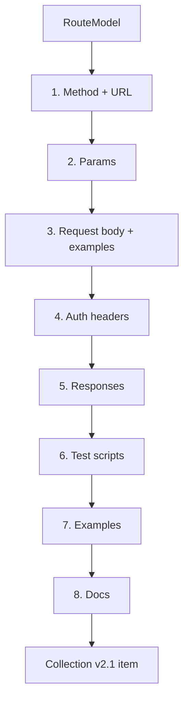

# The engine

!!! info "Scope"
    This page documents the deterministic, framework-parser pipeline (the [input
    resolver](resolver.md) feeds it). The seven slash commands have Claude author the
    Postman item directly instead, following the same output shape described below —
    see the [architecture overview](overview.md). This engine is what the lower-level
    MCP tools use for fully deterministic, LLM-free generation, and what backs the
    independent verification pass described in [the engineering handoff](handoff.md).

The engine is the only hard part of the deterministic pipeline. Everything else just
decides which routes feed into it.

> **Input:** one normalized `RouteModel`.
> **Output:** one complete Postman Collection v2.1 item: `request`, `response[]`,
> optionally `event[]` (test scripts), and a `description`.

Module: `engine/builder.py`, with helpers in `engine/examples.py` and `engine/tests.py`.

!!! info "The engine is fully deterministic"
    The MCP server runs **no LLM**, interprets **no natural-language prompts**, generates
    **no AI responses**, and depends on **no Anthropic/OpenAI API**. The same `RouteModel`
    always produces the same Collection item — that's what keeps re-syncs reproducible and
    diffs stable. Intelligence (including `/postman:prompt`) lives in Claude Code, *above*
    this engine, never inside it. See the
    [Prompt & skill layer](overview.md#prompt-skill-layer).

## The pipeline



| Step | What it produces |
|---|---|
| **1. Method + URL** | From the route model. `{{base_url}}` prefixes the path; `--into` or `defaultInto` decides the folder. |
| **2. Params** | Path params come from the route pattern; query and header params come from the function signature or decorators. |
| **3. Request body** | Built from the body type (Pydantic model, Zod/Joi/Yup schema, DRF serializer, NestJS DTO, or JSDoc annotation). Each field gets an example value from its type and name. |
| **4. Auth headers** | If the route sits behind something the parser recognizes as auth, set a Bearer `{{token}}` header. |
| **5. Responses** | One saved response by default, picked by priority: explicit response model, then OpenAPI schema, then an inferred default (`responseStyle: single`, no error response). `minimal` adds one generic error; `full` saves every declared 2xx plus a standard error set (400/401/403/404/422/500). |
| **6. Test scripts** | Three tiers, described below. Off entirely unless `generateTests: true`. |
| **7. Examples** | Plausible values for body and params, reused across the request and its saved response. |
| **8. Docs** | The request description, taken from the route's docstring or leading comment. |

## What the output actually looks like

This is real output, not a mockup, for `POST /payments` in
[`examples/fastapi-basic/`](https://github.com/logesh-works/postman-mcp/tree/main/examples/fastapi-basic):

```json
{
  "name": "POST /payments",
  "request": {
    "method": "POST",
    "header": [{ "key": "Content-Type", "value": "application/json" }],
    "url": { "raw": "{{base_url}}/payments", "host": ["{{base_url}}"], "path": ["payments"] },
    "description": "Create a new payment.\n\nCharges the given amount and returns the created payment record.",
    "body": {
      "mode": "raw",
      "raw": "{\n  \"amount\": 4200,\n  \"currency\": \"USD\",\n  \"method\": \"string\"\n}",
      "options": { "raw": { "language": "json" } }
    },
    "auth": {
      "type": "bearer",
      "bearer": [{ "key": "token", "value": "{{token}}", "type": "string" }]
    }
  },
  "response": [
    {
      "name": "201 201",
      "code": 201,
      "body": "{\n  \"id\": 1,\n  \"amount\": 4200,\n  \"currency\": \"USD\",\n  \"status\": \"active\",\n  \"created_at\": \"2026-06-27T10:00:00Z\"\n}"
    }
  ]
}
```

The whole [`examples/`](https://github.com/logesh-works/postman-mcp/tree/main/examples)
tree has one of these checked in per route, under each example's `expected-output/`, so
you can see this for every supported framework without running anything.

## Example values are name-based, not magic

`engine/examples.py` is a lookup table of name fragments to example values, checked as
substrings in order, first match wins:

| Name contains | Example value |
|---|---|
| `email` | `user@example.com` |
| `name` | `Example Name` |
| `amount`, `price`, `total`, `cost` | `4200` |
| `id` | `1` |
| `created_at`, `updated_at`, `*_at`, `date`, `timestamp` | `2026-06-27T10:00:00Z` |
| `status` | `active` |
| `is_`, `has_`, `enabled`, `active` | `true` |

If a field's name doesn't match anything in that table, it falls back to a generic value
for its type (`"string"`, `1`, `1.0`, `true`, `[]`, `{}`). That's why `method` in the
example above shows up as the literal string `"string"`: nothing in the table knows what
a payment method looks like. This is also why `id` shows up as the integer `1` even
though the field is typed `str` in the model. The lookup is purely name-based and doesn't
check the declared type first. You'll edit these by hand for anything domain-specific;
the goal is to save you from typing JSON structure, not to guess your business logic.

## The three test tiers

`engine/tests.py` can emit three tiers of test scripts, in increasing order of how much
they're guessing:

1. **Status.** Deterministic. Asserts the response status code.
2. **Schema.** Deterministic. Asserts the response body has the keys the declared model
   says it should have.
3. **Business-logic.** Inferred, and the only tier that isn't deterministic. Exists in
   code but isn't wired up yet; see [the README's "what does not work yet"](https://github.com/logesh-works/postman-mcp#what-does-not-work-yet).

Status and schema are reliable enough to ship. Business-logic assertions stay opt-in
until there's a way to be confident they're asserting the right thing.

## Why this is all in one place

The hard, fallible work (turning a route into a usable Postman request) lives in exactly
one module. None of the sync commands reimplement it; they just decide which routes
to hand it. Fix a bug in the engine and every command gets the fix at once, regardless
of whether the route came from OpenAPI or code parsing.
