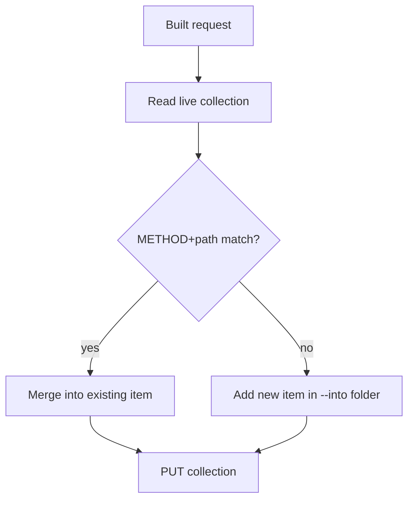

# Merge engine

The public Postman API reads and writes a collection as **one whole object** — there's no
per-request endpoint. So every write is: read the target collection → find or merge the
request → `PUT` the merged collection. The merge engine is what makes that safe and
idempotent.

Module: `postman/merge.py`.

## Identity — matched against the live collection

A route is keyed by `METHOD + normalized path`:

```text
POST:/payments/refund
```

Path parameters normalize across styles, so these are **one** route:

```text
/users/:id    /users/{id}    /users/<id>   →   /users/{id}
```

On sync, the tool reads the live collection's basic structure and matches by this key —
**not** a local registry. Found → update in place. Not found → create. This is why
re-running a sync never produces duplicates.

## Idempotency



Re-running `/postman:syncapi createPayment` twice yields the same collection state — the
second run matches the request created by the first and merges in place.

## Conflict policy — code wins on structure, human wins on craft

When updating an existing request, the merge engine partitions the fields:

| Owner | Fields | On update |
|---|---|---|
| **Code** | params, body shape, responses, auth headers | overwritten from code |
| **Human** | test scripts, manually edited descriptions, manually changed examples | **read back from the existing request and left untouched** |

Only structural fields change. Your hand-written test scripts and curated examples survive
every sync — this is the rule that makes the tool safe to run constantly.

## Deletes are soft by default

A route that exists in the collection but not in code is **soft-deprecated** — marked, not
removed. A hard delete requires an explicit `--purge`. A rename is handled as
soft-delete-old + create-new.

## Folders and `--into`

`--into payments` resolves to the `payments` folder inside the collection, creating it if
missing. Nested paths work too: `auth/oauth`, `orders/v2/fulfillment`. Omitted, it falls
back to `config.defaultInto`.
