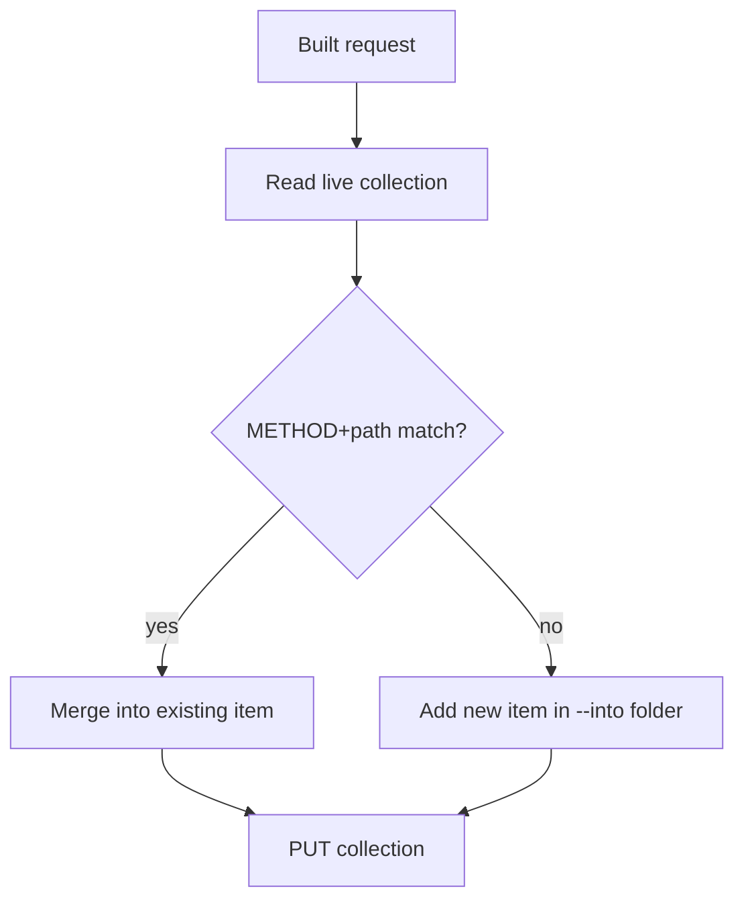

# Merge engine

The Postman API reads and writes a whole collection as one object. There's no
per-request endpoint. So every write looks the same: read the target collection, find or
merge the request into it, `PUT` the merged collection back. The merge engine is what
makes that safe to do over and over without making a mess.

Module: `postman/merge.py`.

## How a route is matched against the live collection

A route is keyed by `METHOD + normalized path`:

```text
POST:/payments/refund
```

Path parameters normalize across styles, so these all collapse to one key:

```text
/users/:id    /users/{id}    /users/<id>   →   /users/{id}
```

On sync, the tool reads the live collection and matches by this key. There's no local
registry of request ids to keep in sync. If the key is found, it updates that item in
place. If not, it creates a new one. That's why re-running a sync never produces
duplicates.

## Idempotency



Run `/postman:syncapi create_payment` twice and you get the same collection state both
times. The second run matches the request the first run created and merges into it
instead of adding a duplicate.

## Code wins on structure, human wins on craft

When updating an existing request, the merge engine splits the fields into two groups:

| Owner | Fields | On update |
|---|---|---|
| **Code** | params, body shape, responses, auth headers | overwritten from code |
| **Human** | test scripts, manually edited descriptions, manually changed examples | read back from the existing request and left alone |

Only the structural fields change. Test scripts and curated examples you wrote by hand
survive every sync. This is the rule that makes it safe to run the sync constantly
instead of being careful about when you do it.

## Deletes are soft by default

A route that exists in the collection but not in code anymore gets soft-deprecated:
marked, not removed. A hard delete needs an explicit `--purge`. A rename is handled as a
soft-delete of the old route plus a create of the new one, since there's no way to tell a
rename apart from a delete-and-add by looking at the code alone.

## Folders and `--into`

`--into payments` resolves to the `payments` folder inside the collection, creating it if
it doesn't exist. Nested paths work too, like `auth/oauth` or `orders/v2/fulfillment`. If
you omit `--into`, it falls back to `config.defaultInto`, which is the collection root
unless you've changed it.
