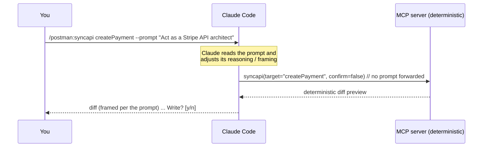
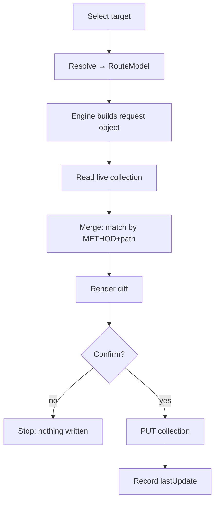

# Architecture overview

Postman MCP is a local stdio MCP server (`postman-mcp serve`) that Claude Code launches.
It exposes one MCP tool per command. The design has two organizing ideas:

> The five sync commands are one engine plus five selectors. The engine does the only
> hard thing: given a pointer to some code, emit a complete Postman request object.
> Everything else just decides which code goes in and where it lands.

> Claude is the intelligence layer; the MCP server is the deterministic execution layer.
> Reasoning, prompt interpretation, and domain expertise live in Claude. Parsing,
> building, merging, and writing live in the MCP server, which runs no model.

## The two layers

```text
Claude Layer          reasoning · prompt / skill interpretation · domain expertise
    ↓
Prompt Processing     --prompt is read here, by Claude, and never forwarded onward
    ↓
MCP Execution Layer   deterministic: parse · build · diff · merge · write
```

| Layer | Owns | Does **not** |
|---|---|---|
| **Claude Code** (intelligence) | Reasoning, `--prompt` / skill interpretation, framing the diff, domain expertise, follow-up edits | Decide route structure, identity, schemas, or merge outcomes |
| **Postman MCP** (execution) | Parsing, synchronization, generation, merging, Postman API integration | Run an LLM, interpret natural-language prompts, depend on any AI provider API |

## Components

```mermaid
flowchart LR
    U[You] -- slash command + optional --prompt --> CC[Claude Code]
    CC -- prompt interpretation --> CC
    CC -- MCP tool call (no prompt forwarded) --> SVR[Postman MCP Server]
    SVR -- diff / results --> CC
    CC -- diff + Write? prompt --> U
    SVR --> R[Input resolver]
    SVR --> E[The engine]
    SVR --> PC[Postman client]
    SVR --> G[Git reader]
    SVR --> CF[Config + secret store]
    R -.OpenAPI or code.-> E
    E -.request object.-> PC
    PC -- REST --> POSTMAN[(api.getpostman.com)]
```

| Component | Module | Responsibility |
|---|---|---|
| Command router | `server.py` | Maps each slash command to one MCP tool, which calls one service function. No business logic of its own. |
| [Input resolver](resolver.md) | `input/resolver.py` | Produces a normalized `RouteModel` from OpenAPI or code, per route. |
| [The engine](engine.md) | `engine/builder.py` | `RouteModel` → a complete Postman Collection v2.1 item. |
| Postman client | `postman/client.py` | Talks to the Postman REST API; reads and writes collections. |
| [Merge engine](merge-engine.md) | `postman/merge.py` | Matches by `METHOD + path`, merges in place, preserves human work. |
| [Diff engine](diff-engine.md) | `diff/render.py` | Renders the before/after preview shown before every write. |
| Git reader | `git/reader.py` | Resolves "what changed since X" for `syncchanges`. |
| Config + secret store | `config/store.py`, `secrets/manager.py` | Reads/writes `postman-mcp.json`; resolves the API key by reference. |

## Prompt & skill layer

Every sync command accepts an optional `--prompt "<instructions>"`. This is **consumed by
Claude, not by the MCP server.**



- **Claude is the intelligence layer.** It interprets the prompt — persona, example style,
  terminology, conventions — and uses it to shape how it prepares and presents the sync.
- **The MCP server is the execution layer.** Its tools have no `prompt` parameter. The
  engine builds the same Postman item it would build with no prompt at all.
- **Prompts influence Claude. Prompts never influence engine structure.** Route matching,
  identity, auth detection, schemas, response contracts, and merge behavior are computed
  from your code, deterministically, no matter what the prompt says.

`--prompt` is the first step of a broader **skill** architecture (see the
[roadmap](../roadmap.md)); the layer boundary is the same for skills as it is for prompts.

## The request lifecycle



## Sources of truth

- **Code** is the truth for what an API *is*, so the tool re-reads the code on every sync.
- **Postman** is the truth for what *exists*, so the tool reads the live collection's
  basic structure to find matches, instead of mirroring request ids locally.
- **`postman-mcp.json`** holds only config and a last-update marker, never a copy of
  what's been pushed. It can't go stale against Postman and it doesn't grow over time.

## Design principle: intelligence/execution separation

The split between reasoning and execution is a core architectural principle, not an
implementation detail:

- **Claude** handles reasoning, prompt interpretation, skill execution, and domain
  expertise.
- **Postman MCP** handles parsing, synchronization, generation, merging, and Postman API
  integration — deterministically, with no LLM in the loop.

Keeping the engine LLM-agnostic is what makes re-syncs reproducible, diffs stable, and the
tool auditable. Intelligence is added *above* the engine, never inside it.

## Safety

These rules are enforced in the service layer, not left to convention:

- **Diff before every write.** No flag to skip it.
- **Code wins on structure, human wins on craft.** Params, body, responses, and auth get
  overwritten from code; test scripts, edited descriptions, and manual examples are read
  back and preserved.
- **Secrets never touch the repo.** The API key is stored by reference only; masked env
  vars use Postman's secret type.
- **Deletes are soft by default.** `--purge` is required for a hard delete.
- **Writing to a non-default collection requires `--confirm`.**
- **Recovery is re-sync, not rollback.** Since the diff stops bad writes before they
  happen and code is the source of truth, fixing a mistaken request is just running the
  sync again.
