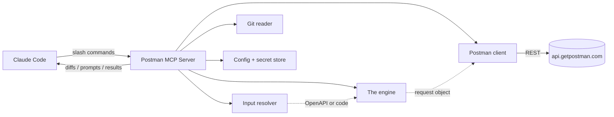
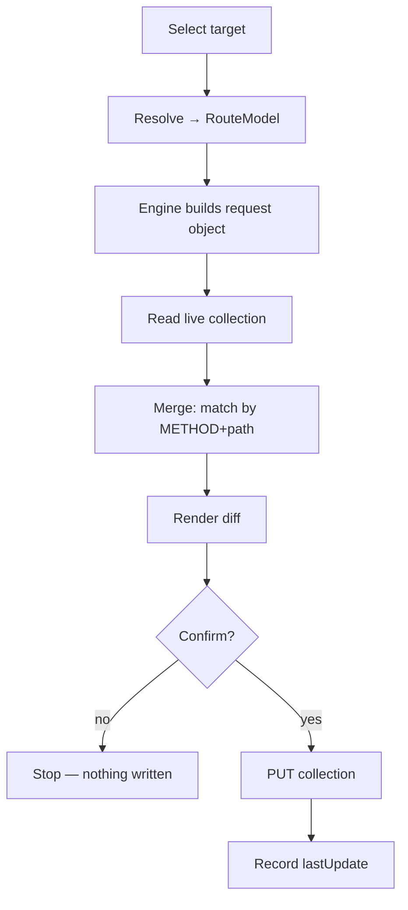

# Architecture overview

Postman MCP is a local stdio MCP server (`postman-mcp serve`) that Claude Code launches.
It exposes one MCP tool per command. The design has one organizing idea:

> The five sync commands are **one engine plus five selectors.** The engine does the only
> hard thing — *given a pointer to some code, emit a complete Postman request object.*
> Everything else decides which code goes in and where it lands.

## Components

| Component | Module | Responsibility |
|---|---|---|
| Command router | `server.py` | Maps each slash command to one MCP tool → a service call. No business logic. |
| [Input resolver](resolver.md) | `input/resolver.py` | Produces a normalized `RouteModel` from OpenAPI or code, per route. |
| [The engine](engine.md) | `engine/builder.py` | `RouteModel` → a complete Postman Collection v2.1 item. |
| Postman client | `postman/client.py` | Talks to the Postman REST API; reads and writes collections. |
| [Merge engine](merge-engine.md) | `postman/merge.py` | Matches by `METHOD + path`, merges in place, preserves human work. |
| [Diff engine](diff-engine.md) | `diff/render.py` | Renders the before/after preview shown before every write. |
| Git reader | `git/reader.py` | Resolves "what changed since X" for `syncchanges`. |
| Config + secret store | `config/store.py`, `secrets/manager.py` | Reads/writes `postman-mcp.json`; resolves the API key by reference. |

## The request lifecycle

## Sources of truth

- **Code** is the truth for what an API *is* — so the tool re-reads the code on every sync.
- **Postman** is the truth for what *exists* — so the tool reads the live collection's
  basic structure to find matches, rather than mirroring request ids locally.
- **`postman-mcp.json`** is only config + a last-update marker — never a copy of what's
  been pushed. It can't go stale against Postman and never bloats.

## Safety

These rules are non-negotiable and enforced in the service layer:

- **Diff before every write.** No skip flag.
- **Code wins on structure, human wins on craft.** Params, body, responses, and auth are
  overwritten from code; test scripts, edited descriptions, and manual examples are read
  back and preserved.
- **Secrets never touch the repo.** The API key is stored by reference only; masked env
  vars use Postman's secret type.
- **Deletes are soft by default.** `--purge` is required for a hard delete.
- **Non-default collection writes require `--confirm`.**
- **Recovery is re-sync, not rollback.** Because the diff stops bad writes and code is the
  source of truth, fixing a mistaken request is just re-running the sync.
