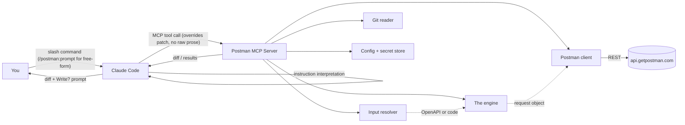
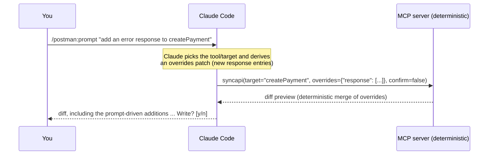
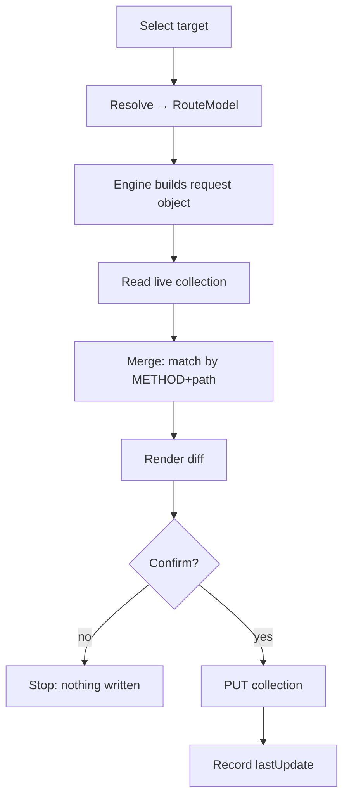

# Architecture overview

Postman MCP is a local stdio MCP server (`postman-mcp serve`) that Claude Code launches.
This page covers the original six-command pipeline. A second, separate tool surface
exists alongside it — see [`docs/architecture/handoff.md`](handoff.md) for what it is and
why. The design behind the six commands has two organizing ideas:

> The sync commands are one engine plus several selectors. The engine does the only
> hard thing: given a pointer to some code, emit a complete Postman request object.
> Everything else just decides which code goes in and where it lands.

> Claude is the intelligence layer; the MCP server is the deterministic execution layer.
> Reasoning, prompt interpretation, and domain expertise live in Claude. Parsing,
> building, merging, and writing live in the MCP server, which runs no model.

## The two layers

```text
Claude Layer          reasoning · instruction / skill interpretation · domain expertise
    ↓
Prompt Processing     /postman:prompt text is read here, by Claude, and never forwarded as
                       raw text; Claude turns it into a structured `overrides` patch instead
    ↓
MCP Execution Layer   deterministic: parse · build · merge overrides · diff · merge · write
```

| Layer | Owns | Does **not** |
|---|---|---|
| **Claude Code** (intelligence) | Reasoning, `/postman:prompt` / skill interpretation, deriving the `overrides` patch, framing the diff, domain expertise, follow-up edits | Decide route identity, perform the Postman write, or run merge-engine logic |
| **Postman MCP** (execution) | Parsing, synchronization, generation, merging `overrides` onto the built item, Postman API integration | Run an LLM, interpret natural-language prompts, depend on any AI provider API |

## Components



| Component | Module | Responsibility |
|---|---|---|
| Command router | `server.py` | Maps each slash command to one MCP tool, which calls one service function. No business logic of its own. |
| [Input resolver](resolver.md) | `input/resolver.py` | Produces a normalized `RouteModel` from OpenAPI or code, per route. |
| [The engine](engine.md) | `engine/builder.py` | `RouteModel` → a complete Postman Collection v2.1 item. |
| Postman client | `postman/client.py` | Talks to the Postman REST API; reads and writes collections. |
| [Merge engine](merge-engine.md) | `postman/merge.py` | Matches by `METHOD + path`, merges in place, preserves human work. |
| [Diff engine](diff-engine.md) | `diff/render.py` | Renders the before/after preview shown before every write. |
| Git reader | `git/reader.py` | Resolves "what changed since X" for `syncchanges`. |
| Config + secret store | `config/store.py`, `secrets/manager.py` | Reads/writes `postman-mcp.json`; resolves the API key by reference. |

## Prompt & skill layer

Free-form, natural-language sync happens through the [`/postman:prompt`](../commands/prompt.md)
command. The raw text is **consumed by Claude, not by the MCP server** — but what Claude
derives from it can still reach the built item, through an explicit, structured channel:
the `overrides` argument.



- **Claude is the intelligence layer.** It interprets the instruction — which tool/target,
  plus persona, example style, conventions, or concrete content like extra error
  responses — and decides what, if anything, that implies for the built item.
- **The MCP server is the execution layer and stays a pure function of its inputs.** Its
  tools have no `prompt` parameter and run no model; given the same `target` and
  `overrides`, they always build the same item. `overrides` is data, not instructions — a
  JSON patch merged onto the item by `engine.builder.apply_overrides` (dicts merge
  key-by-key, lists merge by `key`/`name`), with no parsing of natural language anywhere
  in the server.
- **Route matching, identity, auth detection, and schema inference are unaffected by the
  instruction or `overrides`.** Those stay 100% derived from your code. `overrides` only
  ever adjusts the request/response *content* of the item already matched to that route.
- **The diff still gates every write.** Whatever `overrides` adds shows up in the diff
  preview before any write, exactly like code-derived content — there's no path for an
  instruction to write something the user didn't see and confirm.

`/postman:prompt` is the first step of a broader **skill** architecture (see the
[roadmap](../roadmap.md)); the layer boundary is the same for skills as it is for the
prompt command.

## The request lifecycle



## Sources of truth

- **Code** is the truth for what an API *is*, so the tool re-reads the code on every sync.
- **Postman** is the truth for what *exists*, so the tool reads the live collection's
  basic structure to find matches, instead of mirroring request ids locally.
- **`postman-mcp.json`** holds only config and a last-update marker, never a copy of
  what's been pushed. It can't go stale against Postman and it doesn't grow over time.

## Design principle: intelligence/execution separation

The split between reasoning and execution is a core architectural principle, not an
implementation detail:

- **Claude** handles reasoning, prompt interpretation, skill execution, and domain
  expertise.
- **Postman MCP** handles parsing, synchronization, generation, merging, and Postman API
  integration — deterministically, with no LLM in the loop.

Keeping the engine LLM-agnostic is what makes re-syncs reproducible, diffs stable, and the
tool auditable. Intelligence is added *above* the engine, never inside it.

## Safety

These rules are enforced in the service layer, not left to convention:

- **Diff before every write.** No flag to skip it.
- **Code wins on structure, human wins on craft.** Params, body, responses, and auth get
  overwritten from code; test scripts, edited descriptions, and manual examples are read
  back and preserved.
- **Secrets never touch the repo.** The API key is stored by reference only; masked env
  vars use Postman's secret type.
- **Deletes are soft by default.** `--purge` is required for a hard delete.
- **Writing to a non-default collection requires `--confirm`.**
- **Recovery is re-sync, not rollback — for these six commands.** Since the diff stops
  bad writes before they happen and code is the source of truth, fixing a mistaken
  request from `syncapi`/`sync`/`syncall`/`syncchanges` is just running the sync again.
  There's no snapshot/rollback here by design, and that's deliberate: nothing these
  commands write can't be re-derived from the code that's still sitting right there.
  The separate submitted-model tool surface (`plan`/`apply`) *can* sync content an LLM
  contributed that the diff alone doesn't fully vouch for, so it snapshots before every
  write and has a real `rollback` — see
  [`docs/architecture/handoff.md`](handoff.md).
