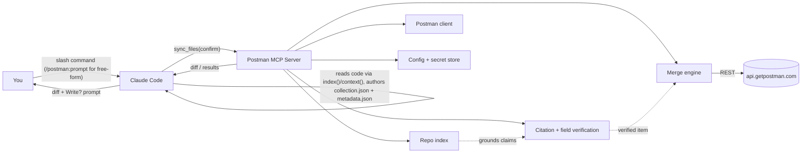
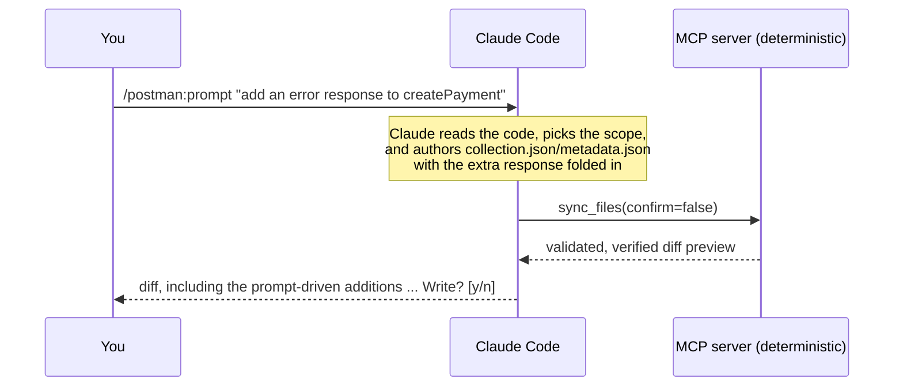
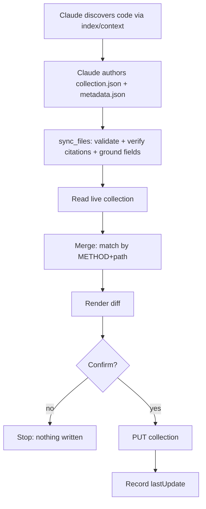

# Architecture overview

Postman MCP is a local stdio MCP server (`postman-mcp serve`) that Claude Code launches.

The seven slash commands are **Claude-driven**: Claude reads your code — any framework —
and writes `postman/sync/<module>/{collection,metadata}.json` per module (`auth/`,
`users/`, ...), plus a shared `postman/sync/sync.config.json`. An ungrouped
`postman/sync/{collection,metadata}.json` covers anything with no clear module. The MCP
server assembles every module into one named folder in the target collection, validates
the result, verifies every citation against your actual source (re-reading only the
cited lines, never parsing your whole codebase), grounds every claimed field against the
real DTO class, diffs against live Postman, and syncs on confirm. The contract Claude
follows is published by the `get_sync_contract` tool, so any MCP-capable client — not
just Claude Code — can drive it.

A second, lower-level tool surface exists alongside the seven commands, built around a
framework-parser engine and a submit → verify → plan → apply pipeline — see
[`docs/architecture/handoff.md`](handoff.md) for what it is, why it exists, and how it
relates to the command path above. The design behind the seven commands has two
organizing ideas:

> The sync commands are one engine plus several selectors. The engine does the only
> hard thing: given a pointer to some code, emit a complete Postman request object.
> Everything else just decides which code goes in and where it lands.

> Claude is the intelligence layer; the MCP server is the deterministic execution layer.
> Reasoning, prompt interpretation, and domain expertise live in Claude. Parsing,
> building, merging, and writing live in the MCP server, which runs no model.

## The two layers

```text
Claude Layer          reasoning · code discovery · instruction / skill interpretation ·
                       authoring collection.json + metadata.json (citations included)
    ↓
MCP Execution Layer    deterministic: validate · verify citations · ground fields ·
                       diff · merge · write
```

| Layer | Owns | Does **not** |
|---|---|---|
| **Claude Code** (intelligence) | Reasoning, code discovery, `/postman:prompt` / skill interpretation, authoring the collection and its citations, framing the diff, domain expertise, follow-up edits | Decide whether a citation is real, perform the Postman write, or run merge-engine logic |
| **Postman MCP** (execution) | Validating the authored collection, re-reading and re-hashing every citation, grounding claimed fields against the real code, diffing, merging, writing | Run an LLM, interpret natural-language prompts, depend on any AI provider API |

## Components



| Component | Module | Responsibility |
|---|---|---|
| Command router | `server.py` | Maps each slash command to one MCP tool, which calls one service function. No business logic of its own. |
| [Repo index & retrieval](indexing.md) | `index/`, `retrieve/` | A deterministic, framework-blind map of the repo (files, symbols, import graph, service roots) that Claude queries via `index()`/`context()` instead of reading files unbounded. |
| Citation + field verification | `verify/` | Re-reads and re-hashes every cited `file:line`, and grounds every claimed request/response field against the real DTO/class the index found. |
| [Merge engine](merge-engine.md) | `postman/merge.py` | Matches by `METHOD + path`, merges in place, preserves human work. |
| [Diff engine](diff-engine.md) | `diff/render.py` | Renders the before/after preview shown before every write. |
| Postman client | `postman/client.py` | Talks to the Postman REST API; reads and writes collections. |
| Config + secret store | `config/store.py`, `secrets/manager.py` | Reads/writes `postman/config.json`; resolves the API key by reference. |

The [input resolver](resolver.md) and [the engine](engine.md) — OpenAPI/code parsing
into a `RouteModel`, then a `RouteModel` into a Postman item — are a separate,
still-current pipeline. It's not on the path above; see
[`docs/architecture/handoff.md`](handoff.md) for what it's used for instead.

## Prompt & skill layer

Free-form, natural-language sync happens through the [`/postman:prompt`](../commands/prompt.md)
command. The instruction is **read by Claude, not by the MCP server**: Claude decides
scope and target from it, then folds the "how" — a persona, extra error responses, an
edited description — directly into the `collection.json`/`metadata.json` it authors,
exactly as it would any other content. There's no separate patch object the server
merges on the slash-command path; the server's job starts after Claude has already
written the files.



- **Claude is the intelligence layer.** It interprets the instruction — which command
  and target, plus persona, example style, conventions, or concrete content like extra
  error responses — and writes that directly into the collection it authors.
- **The MCP server is the execution layer and stays a pure function of its inputs.** It
  has no `prompt` parameter and runs no model. It validates the collection Claude wrote,
  re-reads and re-hashes every citation against your actual source, grounds every
  claimed field against the real code, and diffs the result — content Claude added that
  has no citation (like a hand-written extra error example) is simply shown as
  unverified in the diff, which is correct and honest.
- **Route identity, citations, and field grounding are unaffected by the instruction.**
  A citation either matches the code or it doesn't, regardless of what the instruction
  asked for.
- **The diff still gates every write.** Whatever the instruction adds shows up in the
  diff preview before any write — there's no path for an instruction to write something
  the user didn't see and confirm.

`/postman:prompt` is the first step of a broader **skill** architecture (see the
[roadmap](../roadmap.md)); the layer boundary is the same for skills as it is for the
prompt command. The lower-level tool surface (`syncapi`/`syncchanges`/`sync`/`syncall`
called directly, not through a slash command) still accepts an explicit `overrides`
patch for scripted callers that don't want an LLM in the loop at all — see
[`docs/architecture/handoff.md`](handoff.md).

## The request lifecycle



## Sources of truth

- **Code** is the truth for what an API *is*, so the tool re-reads the code on every sync.
- **Postman** is the truth for what *exists*, so the tool reads the live collection's
  basic structure to find matches, instead of mirroring request ids locally.
- **`postman/config.json`** holds only config and a last-update marker, never a copy of
  what's been pushed. It can't go stale against Postman and it doesn't grow over time.

## Design principle: intelligence/execution separation

The split between reasoning and execution is a core architectural principle, not an
implementation detail:

- **Claude** handles reasoning, prompt interpretation, skill execution, and domain
  expertise.
- **Postman MCP** handles parsing, synchronization, generation, merging, and Postman API
  integration — deterministically, with no LLM in the loop.

Keeping the engine LLM-agnostic is what makes re-syncs reproducible, diffs stable, and the
tool auditable. Intelligence is added *above* the engine, never inside it.

## Safety

These rules are enforced in the service layer, not left to convention:

- **Diff before every write.** No flag to skip it.
- **Code wins on structure, human wins on craft.** Params, body, responses, and auth get
  overwritten from code; test scripts, edited descriptions, and manual examples are read
  back and preserved.
- **Secrets never touch the repo.** The API key is stored by reference only; masked env
  vars use Postman's secret type.
- **Deletes are soft by default.** `--purge` is required for a hard delete.
- **Writing to a non-default collection requires `--confirm`.**
- **Recovery is re-sync, not rollback — for these commands.** Since the diff stops
  bad writes before they happen and code is the source of truth, fixing a mistaken
  request from `syncapi`/`sync`/`syncall`/`syncchanges` is just running the sync again.
  There's no snapshot/rollback here by design, and that's deliberate: nothing these
  commands write can't be re-derived from the code that's still sitting right there.
  The separate submitted-model tool surface (`plan`/`apply`) *can* sync content an LLM
  contributed that the diff alone doesn't fully vouch for, so it snapshots before every
  write and has a real `rollback` — see
  [`docs/architecture/handoff.md`](handoff.md).
