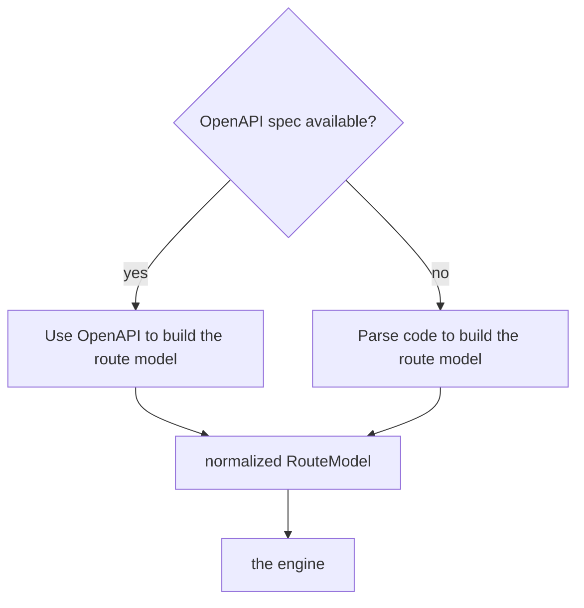

# Input resolver

The resolver produces a normalized `RouteModel` from whichever source is available. An
OpenAPI spec is preferred when one exists: it's the framework's own typed, validated
declaration of the API, so trusting it is both more accurate and cheaper than
re-deriving the same facts by parsing source files. Code parsing is the fallback, and for
frameworks with no spec generator (Express), it's the only option.

Module: `input/resolver.py`, with `input/detect.py`, `input/openapi.py`, and
`input/parsers/`.

## The decision



Both paths produce the same `RouteModel` shape, so nothing downstream needs to know or
care which source a given route came from:

```text
RouteModel {
  method, path, pathParams, queryParams, headers,
  bodyType, responseTypes, authRequired, docstring, codeRef
}
```

## How "is a spec available" gets decided

In priority order, the resolver looks for a spec:

1. **Explicit path in config.** `config.openApiSource`, a file path or a URL like
   `http://localhost:8000/openapi.json`.
2. **A live framework endpoint.** FastAPI and NestJS serve a spec at a well-known route
   (`/openapi.json`, `/api-json`). If the app happens to be running, it fetches it.
3. **A committed spec file.** `openapi.json`, `openapi.yaml`, or `swagger.json` in the
   project.
4. **Generated on demand.** For frameworks that can produce a spec without a running
   server, like FastAPI's `app.openapi()`, it generates one in a short subprocess.

If any step finds one, that route set uses OpenAPI. If none do, it parses code instead.
`init` records the result in `config.inputMode`, and every later sync re-checks
freshness, so a spec that goes stale or disappears falls back to code automatically.

## Path A: use OpenAPI

One mapper handles every framework that emits valid OpenAPI 3.x. There's no
framework-specific code here (`input/openapi.py`):

- `paths.{path}.{method}` becomes method, path, and params.
- `requestBody.content.*.schema` (resolving `$ref` against `components.schemas`) becomes
  the body type.
- `responses.{code}.content.*.schema` becomes the response types.
- `security` and `components.securitySchemes` decide whether auth is required.
- `summary` and `description` become the docstring.

This is the default path for FastAPI, for NestJS with `@nestjs/swagger`, and for DRF with
`drf-spectacular`.

## Path B: parse code (the fallback)

Used when there's no spec. For Express, which has no native spec generator, this is the
only path that exists (`input/parsers/`):

| Framework | Routes from | Types from | Auth from |
|---|---|---|---|
| FastAPI | `@app.post("/path")` | Pydantic models, `response_model` | `Depends(get_current_user)` |
| Express | `app.get`/`post`, router mounts | Joi/Zod/Yup schema, JSDoc `@body` tags, or inferred from `req.body` usage (weakest) | auth middleware, inline or registered with `app.use()` |
| Django (DRF) | `urls.py` patterns, including `.as_view({...})` mappings and `DefaultRouter`/`SimpleRouter`-registered viewsets | serializers | `permission_classes` |
| NestJS | `@Controller` + `@Post()` | DTOs with class-validator | `@UseGuards(AuthGuard)` |
| Flask | `@app.route`/`@bp.route`, blueprint mounts | inferred from `request.json`/`.form` usage (weakest — Flask has no built-in typed body) | `@login_required`-style decorators |
| Spring (Boot) | `@RequestMapping`/`@GetMapping`/etc. | `@RequestBody Dto` resolved against the DTO class | not detected — see the [framework guide](../frameworks/spring.md) |

See the [framework guides](../frameworks/fastapi.md) for the details and the current
known limits of each parser.

## Composing the full path

For frameworks where routes are registered piecemeal across files — a router mounted in
one module, its routes declared in another — reading only the leaf decorator gives you a
path fragment, not the real URL. `input/structural.py` builds an actual import/mount
graph for FastAPI, Flask, and Express (`build_fastapi`, `build_flask`, `build_express`)
and composes the full prefix chain from it. Django and Spring don't need this: Django's
`include()` chain and Spring's class-level `@RequestMapping` are resolved directly inside
their own parsers, without a separate graph pass.

When a mount genuinely can't be traced — a prefix built from a variable, a dynamic
`require()`/import, a cross-package boundary — the resolver reports it unresolved rather
than guessing at a path. That's a deliberate choice: a route with a wrong composed path
is worse than one flagged as unknown, since the wrong one looks correct until something
breaks against it in Postman.

## Per-route mixing

Resolution happens per route, not per project. If a spec covers most endpoints but
misses a few (a manually mounted router, an undocumented route), those individual routes
fall back to code parsing while the rest still use the spec. The
[diff](diff-engine.md) tags each request `[openapi]` or `[code]` so you can see which
ones are lower confidence.

## When two code routes claim the same path

If two different files both register a route at the same method and path (for example,
two route modules both defining `GET /profile`), the resolver doesn't silently let one
overwrite the other. It keeps whichever one it parsed first and adds a note to the sync
output naming both files, so you can check which one is actually correct instead of
finding out later that the wrong handler got synced.
