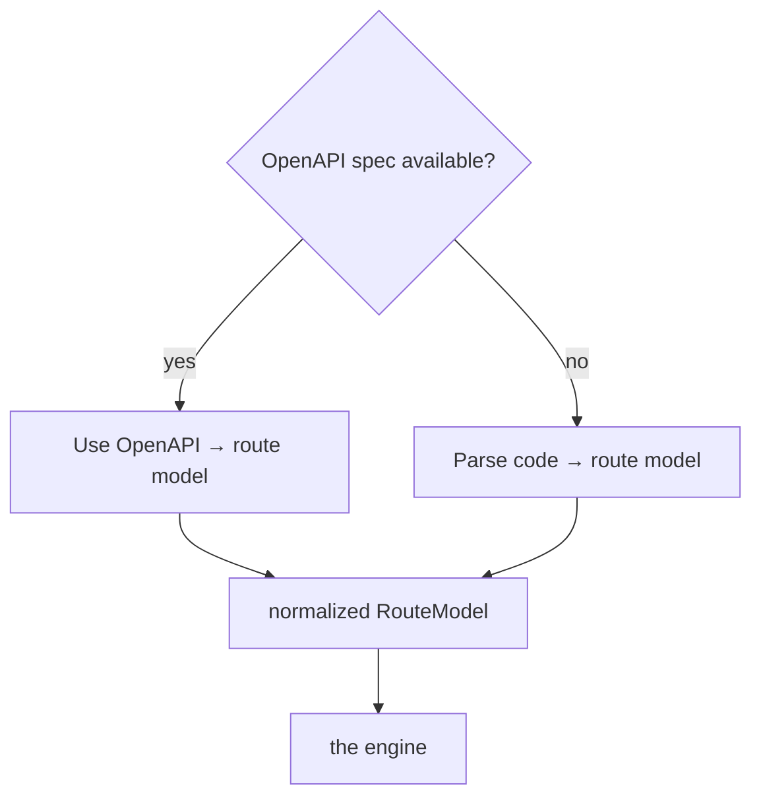

# Input resolver

The resolver produces a normalized `RouteModel` from the **best available source**. An
OpenAPI spec is always preferred when one exists — it's the framework's own typed,
complete declaration of the API, so trusting it is both more accurate and far cheaper than
re-deriving the same facts from raw source. Code parsing is the fallback.

Module: `input/resolver.py` (with `input/detect.py`, `input/openapi.py`, and
`input/parsers/`).

## The decision



Both paths emit the **same** `RouteModel`, so everything downstream is identical
regardless of source:

```text
RouteModel {
  method, path, pathParams, queryParams, headers,
  bodyType, responseTypes, authRequired, docstring, codeRef
}
```

## "OpenAPI available?" — how it's decided (PRD §9.2)

In priority order, the resolver looks for a spec:

1. **Explicit path** in config — `config.openApiSource` (a file path or a URL like
   `http://localhost:8000/openapi.json`).
2. **Live framework endpoint** — FastAPI/NestJS serve a spec at a well-known route
   (`/openapi.json`, `/api-json`). If the app is running, fetch it.
3. **Committed spec file** — `openapi.json` / `openapi.yaml` / `swagger.json`.
4. **Generated on demand** — for frameworks that can emit a spec without a running server
   (e.g. FastAPI's `app.openapi()`), produce one in a short subprocess.

Found at any step → **use OpenAPI**. None found → **parse code**. `init` records the
result in `config.inputMode`, and every later sync re-checks freshness — a stale or
missing spec falls back to code automatically.

## Path A — Use OpenAPI

One mapper covers every framework that emits valid OpenAPI 3.x — no framework-specific
code (`input/openapi.py`):

- `paths.{path}.{method}` → method + path + params
- `requestBody.content.*.schema` (resolving `$ref` into `components.schemas`) → `bodyType`
- `responses.{code}.content.*.schema` → `responseTypes`
- `security` / `components.securitySchemes` → `authRequired`
- `summary` / `description` → `docstring`

This is the default for FastAPI, NestJS (with `@nestjs/swagger`), and DRF (with
`drf-spectacular`).

## Path B — Parse code (fallback)

Used when no spec exists — most commonly **Express**, which has no native spec
(`input/parsers/`):

| Framework | Routes from | Types from | Auth from |
|---|---|---|---|
| FastAPI | `@app.post("/path")` | Pydantic models, `response_model` | `Depends(get_current_user)` |
| Express | `app.get/post`, router mounts | JSDoc / inline (weaker) | auth middleware in the chain |
| Django (DRF) | `urls.py`, viewsets | serializers | `permission_classes` |
| NestJS | `@Controller` + `@Post()` | DTOs with class-validator | `@UseGuards(AuthGuard)` |

See the [framework guides](../frameworks/fastapi.md) for the specifics and known limits.

## Per-route mixing (PRD §9.5)

Resolution is **per route, not per project**. If a spec covers most endpoints but misses a
few (a manually mounted router, an undocumented route), those individual routes fall back
to code parsing while the rest use the spec. The [diff](diff-engine.md) labels each request
`[openapi]` or `[code]` so lower-confidence ones are visible.
