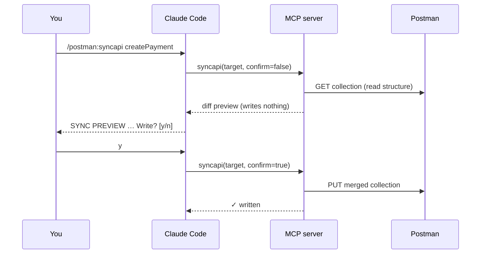

# Commands

After [`postman-mcp init`](../getting-started/quickstart.md), six slash commands are
available inside Claude Code. The five sync commands are **one engine plus five
selectors** — they all build the same complete Postman request; they differ only in
*which* code goes in and *where* it lands.

| Command | One-liner |
|---|---|
| [`/postman:syncapi`](syncapi.md) | Sync **one** API. The kernel. |
| [`/postman:syncchanges`](syncchanges.md) | Sync **what changed** since last sync. The daily driver. |
| [`/postman:sync`](sync.md) | Sync everything in one file / module / directory. |
| [`/postman:syncall`](syncall.md) | Sync the **whole** codebase. First-run / post-refactor. |
| [`/postman:createenv`](createenv.md) | Generate a Postman environment from code. |
| [`/postman:status`](status.md) | Read-only **drift check**. No writes. |

## The diff-then-confirm contract

Every write-capable command follows the same two-phase contract, so nothing reaches
Postman by surprise:

On `n`, nothing is written. There is **no skip flag** — see the
[safety rules](../architecture/overview.md#safety).

## Terminal vs. Claude Code

The `/postman:*` commands above run **inside Claude Code**. Setup commands run in the
**terminal** and are not slash commands:

- `postman-mcp init` — one-time project setup.
- `postman-mcp doctor` — re-validate the whole setup chain.
- `postman-mcp serve` — boot the MCP server (Claude Code launches this for you).
- `postman-mcp version` — print the version.
