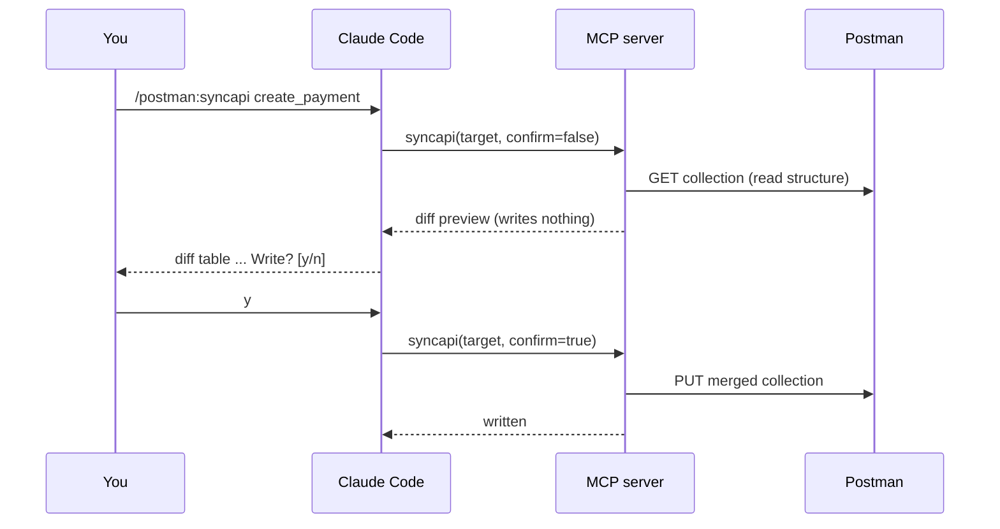

# Commands

After [`postman-mcp init`](../getting-started/quickstart.md), six slash commands are
available inside Claude Code. The five sync commands aren't five separate
implementations: they all build the same complete Postman request through the same
engine, and differ only in which routes they pick and where the result lands.

| Command | One-liner |
|---|---|
| [`/postman:syncapi`](syncapi.md) | Sync one route. The kernel that everything else is built on. |
| [`/postman:syncchanges`](syncchanges.md) | Sync what changed since the last sync. The one you'll run most. |
| [`/postman:sync`](sync.md) | Sync everything in one file, module, or directory. |
| [`/postman:syncall`](syncall.md) | Sync the whole codebase. Usually a first-run or post-refactor thing. |
| [`/postman:createenv`](createenv.md) | Generate a Postman environment from your code. |
| [`/postman:status`](status.md) | Show drift without writing anything. |

## The diff-then-confirm contract

Every write-capable command follows the same two-phase contract, so nothing reaches
Postman as a surprise:

On `n`, nothing is written. There's no flag to skip this step; see the
[safety rules](../architecture/overview.md#safety). Once the result is shown (either the
write confirmation or the `n` abort), the command ends. Claude doesn't keep going with
more analysis or commentary after that.

## Adding guidance with `--prompt`

The four sync commands (`syncapi`, `sync`, `syncchanges`, `syncall`) take an optional
`--prompt "<text>"`. It's guidance for **Claude**, read while it prepares the sync — it's
**consumed by Claude, not by the MCP server**, which has no `prompt` parameter and stays
deterministic. Prompts influence Claude's reasoning and framing, never engine structure
(route matching, identity, auth, schemas, merge). See the
[Prompt & skill layer](../architecture/overview.md#prompt-skill-layer).

## Terminal vs. Claude Code

The `/postman:*` commands above run inside Claude Code. Setup commands run in the
terminal and aren't slash commands:

- `postman-mcp init`: one-time project setup.
- `postman-mcp doctor`: re-validate the whole setup chain.
- `postman-mcp serve`: boot the MCP server (Claude Code launches this for you, you
  shouldn't need to run it by hand).
- `postman-mcp version`: print the version.
